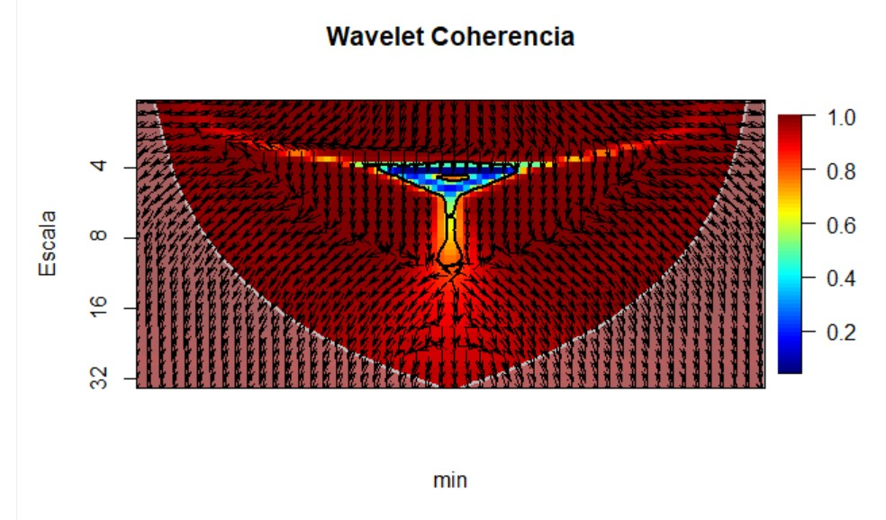
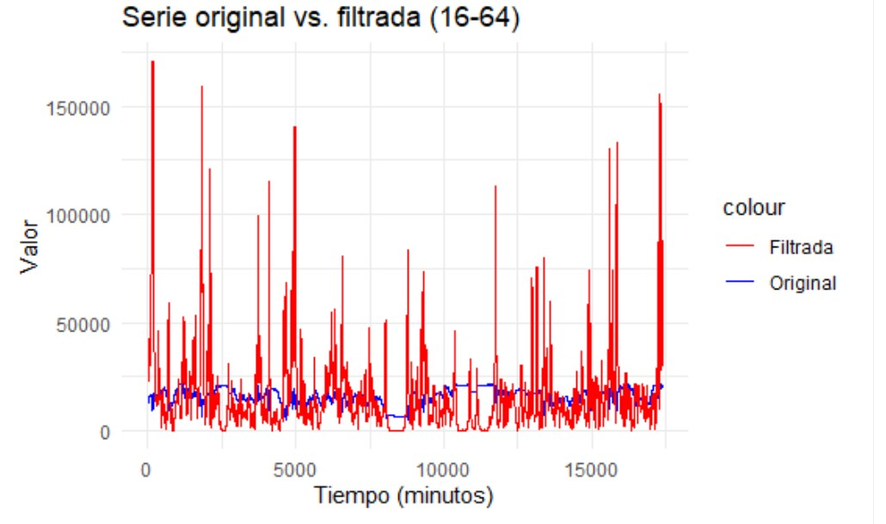
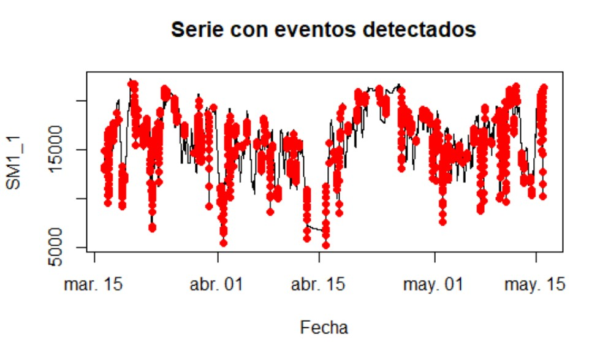

# Examen Programación en R
Examen R
Analisis de Señales presión tuberias en trazado concentraducto

**Realizado por: Marcelo Carmona -  Paula Alvarez **

Revisar Codigo en Posit Examen
<a href="https://posit.cloud/spaces/658449/content/10442178" target="_blank">Enlace Posit</a>

Revisar Video Examen: 
<a href="https://drive.google.com/file/d/109kDBTHa2YqdJYeZaO4FH5POjJ_YKC1E/view?usp=sharing" target="_blank">Enlace Video</a>


**Contexto**

El transporte de solidos por tuberias a larga distancia, y en especial el transporte de concentrado como pulpa o conocido en el ambito minero como concentraducto, requiere un estricto control de los parametros de operación, manteniendo un control en todo momento de presiones a lo largo de la longitud de este concentraducto, debido a que dicho transporte es realizado manteniendo la presurización de la tubería de modo de evitar complicaciones operacionales y permita el desplzamiento de la pulpa hasta el sector de alimentación a espesadores de concentrado comunmente.

Para el control y continuidad operacional de este concentraducto es relevante mantener monitoreando las presiones en las estaciones de monitoreo y de válvulas en el trazado longittudinal. La data que disponemos y que sera utilizada para el analisis respectivo, contempla cuatro estaciones de monitoreo y dos estaciones de válvulas, cada estacion de monitoreo dispone de dos trasmisores de presión donde el valor de presión es enviada remotamente a sala de control, este valor que indica la presion en punto de la tuberia en forma continua, es visualizada en pantalla de salas de sala de operaciones en instalaciones de ubicadas en la ciudad de Antofagasta, en el centro de gestión operativa.

Un transmisor de presión convierte la medición de la presión de un fluido en una señal eléctrica que puede ser transmitida a sistemas de control o visualización. Funciona detectando los cambios de presión y transformándolos en variaciones de voltaje, corriente o resistencia, que luego son amplificadas y convertidas en una señal estándar. 

Para el correcto control operacional del concentraducto es vital tomar las medidas operacionales necesarias para no exceder presiones en tuberias acorde al diseño de ingenieria establecido en su contrucción, por ello se requiere que los instrumentos (transmisores de presión) entreguen confiabilidad en la operación indicando señales permanentes que refleje los cambios que pudieran producirse en la operación de transporte de concentrado (cambios de fase agua /pulpa, variación de velocidad de bombas de desplazamiento positivo, cambios en reologías de transporte). Es relevante, del punto de vista de integridad de activos que estos instrumentos entreguen señales con la fiabilidad necesaria para sostener el control operativo de un transporte de concentrado por tuberías, es importante que en los momentos de mayor exigencias que es cuando se transporta pulpa tengamos la seguridad que las señales que estan llegando a pantalla en sala de control reflefen en todo momento cambios que pudieran producirse en el proceso de modo de conocer las tendencias en la presurización de estas tuberias y tomar los resguardos necesarios para mantener la continuida operativa del sistema.


 


Por ello, en este trabajo se plantea analizar dichas señales de instrumentos ubicados en la primera estación de monitoreo (SM1) del trazado por la importancia que posee en el trazado de transporte de concentrado de la pulpa desde la estación de bombeo, esta estación posee dos transmisores de presion (SM1_1 y SM1_2), esto con el fin de identificar la operatividad de estos instrumentos, si guardan relación su medición , en que frecuencias se identifica una mayor coherencia, si existe relación entre cambios o eventos que se pueden producir en la operación y los detecte, comparación de energia de señales.

Para esto, utilizaremos transformada de wavelet en particular función wtc.AB (biwavelet) del paquete en R para calcular la coherencia wavelet entre dos series temporales. Esta función proporciona información sobre la dependencia entre las series en diferentes escalas de tiempo y frecuencia.


```{r}
#Cargar librerias requeridas
library(readxl)
library(biwavelet)
library(ggplot2)
library(testthat)
library(zoo) 
```
```{r}
#Cargamos script R en donde se encontraran las funciones a ser utilizadas
source("Funciones.R")  # script donde estaran las funciones a ser utilizadas para el analisis de los datos de nuestra base de datos

```
Utilizando paquete biwavelet nos centraremos en buscar el grafico de coherencia entre dos series de datos que contienen valores de presiones en la primera estación de monitoreo del concentraducto SM1_1 y SM1_2 .

Se utilizara para este caso la función: `"coherencia_vavelet"`, cuyos argumentos son:

function(series1, series2, metodo_tendencia = c("mediana", "promedio"), nrands = 10, titulo = "Wavelet Coherencia", ylab = "Escala", xlab = "min", col_coi = "grey", lwd_coi = 2, plot_phase = TRUE, mostrar_tendencia = TRUE, verbose = TRUE). La descripcion de cada argumento de esta función es:

-   **`series1`** y **`series2`**: Estas son las dos series de tiempo que se van a analizar. Son los datos principales sobre los que se calculará la coherencia wavelet.

-   **`metodo_tendencia`**: Este argumento determina el método para eliminar la tendencia de las series de tiempo. Las opciones son:

    -   **`"mediana"`**: Utiliza la mediana para corregir la tendencia.

    -   **`"promedio"`**: Utiliza el promedio (media) para corregir la tendencia. El valor por defecto es `"mediana"`.

-   **`nrands`**: Este argumento especifica el número de iteraciones o permutaciones aleatorias que se utilizarán para calcular los niveles de significancia estadística. Un número mayor de iteraciones generalmente proporciona resultados más robustos, pero también aumenta el tiempo de procesamiento. El valor predeterminado es `"10"`

-   **`titulo`**: Una cadena de texto que se utiliza como título principal del gráfico resultante. El valor predeterminado es `"Wavelet Coherencia"`.

-   **`ylab`** y **`xlab`**: Estos argumentos definen las etiquetas del eje Y y del eje X del gráfico, respectivamente.

    -   `ylab` por defecto es `"Escala"`.

    -   `xlab` por defecto es `"min"`.

-   **`col_coi`** y **`lwd_coi`**: Estos argumentos controlan el color y el ancho de la línea de la "Cono de Influencia" (COI por sus siglas en inglés) en el gráfico. El COI es la región donde las estimaciones del análisis wavelet pueden estar influenciadas por los bordes de la serie de tiempo.

    -   `col_coi` por defecto es `"grey"`.

    -   `lwd_coi` por defecto es `2`.

-   **`plot_phase`**: Un valor booleano (`TRUE` o `FALSE`) que determina si se deben graficar los vectores de fase. Estos vectores indican la relación de fase (el desfase temporal) entre las dos series de tiempo en diferentes escalas y tiempos. El valor predeterminado es `TRUE`.

-   **`mostrar_tendencia`**: Un valor booleano (`TRUE` o `FALSE`) que controla si se debe mostrar la tendencia eliminada de las series de tiempo en el gráfico. El valor predeterminado es `TRUE`.

-   **`verbose`**: Un valor booleano (`TRUE` o `FALSE`) que, si es `TRUE`, hará que la función imprima mensajes de progreso o información detallada durante su ejecución. El valor predeterminado es `TRUE`.

```{r}

coherencia_wavelet(PA$SM1_1, PA$SM1_2, metodo_tendencia = "mediana", mostrar_tendencia = FALSE, verbose=TRUE)
```
 

Se incluyen pruebas unitaria implementadas con la función test_file para validar el comportamiento o la robustez de las sección de código `"coherencia_wavelet()"`.

test_file(): Es una función que forma parte de una librería o framework de pruebas (como testthat). Su propósito es leer un archivo de código y ejecutar todas las pruebas que contiene. Estas pruebas están diseñadas para verificar si ciertas partes de tu código (como funciones) se comportan como se espera. Archivo a utilizar test_coherencia.R

```{r}
test_file("test_coherencia.R")
```
 

Al analizar la coherencia de wavelet por medio de su gráfica podemos comparar ambas señales de los PIT ubicados al interior del bunker SM1, donde se puede observar que existe una relacion de coherencia a nivel moderado por los tonos verdes de la gráfica.

La mayoria de la coherencia significativa existe en la escala 16 a 64, por lo que se puede inferir que las series o los datos de ambos pit estan mayormente relacionadas en frecuencias altas. Si interpretamos una frecuencia alta visualizando la operacion del concentraducto lo asociamos a una presurizacion mayor de la tuberia es decir valores mas altos, por lo que nos entregan un valor confiable para frecuencias altas.

Por la ubicacion de las flechas podemos indicar que las series se encuentran en fase, oscilaciones sincronizadas es decir los PIT detectarán un evento operacional relacionado en ese lapso de tiempo, donde ademas el primer PIT (SM1_01) precede al PIT (SM1_02) es el que indica la primera señal. Las flechas indican que estan en sintonia. Los PIT se relacionan sus medida mas coherentemente en frecuencias altas.

Ahora bien, se buscará la energía de la transformada wavelet de dos series de tiempo a través del uso de la función graficar_energia_wavelet contenida en script Funciones.R

Esta función calcula la transformada wavelet de dos series de tiempo, extrae la energía en cada escala y tiempo, y genera un gráfico que muestra la distribución de la energía en función del tiempo y la escala.

```{r}
# Calcula la energía en cada escala y tiempo

graficar_energia_wavelet(PA$SM1_1,PA$SM1_2,"promedio",FALSE)

```
 

Si analizamos las energías de cada serie en función de la escala y tiempo, podemos visualizar que la energía es baja, es decir la serie se considera estable y de baja intensidad, es decir ambos PIT reaccionan de la misma manera entre 16 y 64 hertz, reafirmando el gráfico anterior de coherencia de Wavelet. Ratificando que los transmisores de presión siguen siendo confiables a frecuencias altas.

Ahora bien, se buscará graficar Serie Original vs. Serie Filtrada por Waveletla a través del uso de la función graficar graficar_serie_filtrada contenida en script Funciones.R

Esta función filtra una serie de tiempo utilizando un análisis de wavelet y luego visualiza la serie original junto a la versión filtrada. El filtrado se basa en la selección de un rango específico de periodos (frecuencias) de la transformada de wavelet..

```{r}
graficar_serie_filtrada(PA$SM1_1,PA$SM1_2,16,64,"promedio",FALSE)
```
 

A traves del grafico anterior correspondiente a espectometria de potencia, se graficó para comparar la señal original versus la media de sus valores, determinando la energia de cada una de estas variables y poder comparar ambos graficos y ver si la energia promedio de cada una se condice con la coeherencia de Wavelet. Sabemos que el rango mas coherencia de ambas señales de comportamiento es entre 16 a 64 hertz, estableciendo de que manera la señal original la comparamos con la frecuencia media filtrada de esta forma se aisla el ruido.

Si observamos la linea azul correspondiente a los datos originales y la linea roja correspondiente a los datos filtrados podemos interpretar lo siguiente; la linea roja filtrada sigue una tendencia similar a la linea azul pero con menor variabilidad la linea roja por lo que se puede afirmar que los componentes en esa frecuencia 16 a 64 hertz capturan gran parte del comportamiento general de la serie eliminando los detalles de frecuencias muy altas o muy bajas, es decir reducen el ruido.

Se concluye que la filtración en estos rangos de frecuencia logra seleccionar la estructura general de los valores sin fluctuaciones rapidas y con ruido, por lo que además se logra concluir que ambos PIT que se encuentran en la estación de monitoreo EM1en esta frecuencia de entre 16 y 64 reflejan en mayor proporcion una mejor coherencia . A través de todo el análisis realizado consideramos que los instrumentos actuales en la estación de monitoreo nos entregan la confianza para los eventos de presurizacón de la tuberia, que es cuando los rangos de operación se encuentran cercanos a los máximos.

Se puede inferir que los cambios repentinos en la operación no son a intervalos regulares, esto puede ser por diferentes factores operacionales, como variacion desde sala con las variables velocidad, cambios reológicos de la pulpa a transportar entre otros. El análisis acotado de las presiones en EM1 indican que se debe prestar la atención suficiente y constante en la operatividad del concentraducto a la fecha.

Ahora bien, se buscará graficar la detección de picos o eventos en una serie de tiempo usando la derivada y un umbral de cuantil a través del uso de la función detectar_eventos contenida en script Funciones.R

La función `detectar_eventos` está diseñada para **identificar y visualizar eventos o picos significativos** en una serie de tiempo. Su funcionamiento se basa en el siguiente proceso:

1.  **Cálculo de la derivada:** Primero, la función calcula las diferencias entre los valores consecutivos de la serie de tiempo. Esto es similar a obtener la derivada, lo que resalta los **cambios bruscos** en la serie.

2.  **Detección de picos:** Luego, se establece un umbral utilizando un **cuantil** (por defecto, el 95%). Cualquier cambio (derivada) que sea mayor que este umbral se considera un pico. Esto significa que la función encuentra los cambios más grandes y atípicos en los datos.

3.  **Visualización:** Finalmente, la función genera un gráfico de la serie de tiempo completa y **marca los picos detectados con puntos rojos**, facilitando su identificación visual.

Además de crear el gráfico, la función devuelve los índices de los puntos donde se encontraron los picos, lo que te permite trabajar con esos datos de manera más precisa si lo necesitas. Los parámetros personalizables para el título, ejes, y el umbral del cuantil, hacen a esta función flexible para adaptarse a diferentes conjuntos de datos.

```{r}
detectar_eventos(PA,1,4)
# columna tiempo = 1
# columna series de datos a analizar en este caso la 4, SM1_1, puede ser 5 la SM1_2 o cualquier otra de la base de datos

```
 

Al analizar grafico de series con picos o eventos relevantes, estos están distribuidos relativamente de manera uniforme a lo largo del tiempo, con una cierta concentración en varias zonas, pero sin patronmes claros de periodicidad. La presencia de estos eventos pueden señalar eventos importantes o anomalias en la serie, pueden corresponder a eventos específicos en el proceso que mide la serie: cambios súbitos en la variable, eventos externos, errores de medición, o episodios relevantes. La distribución uniforme de picos sugiere que estos eventos no están asociados a una tendencia o patrón periódico, sino que ocurren de manera más aleatoria o como respuesta a eventos externos.


