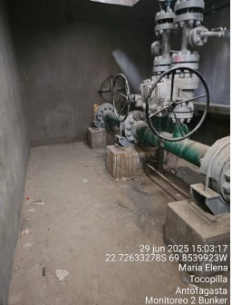
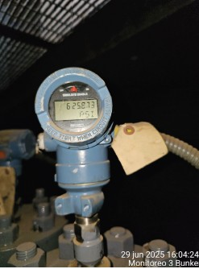
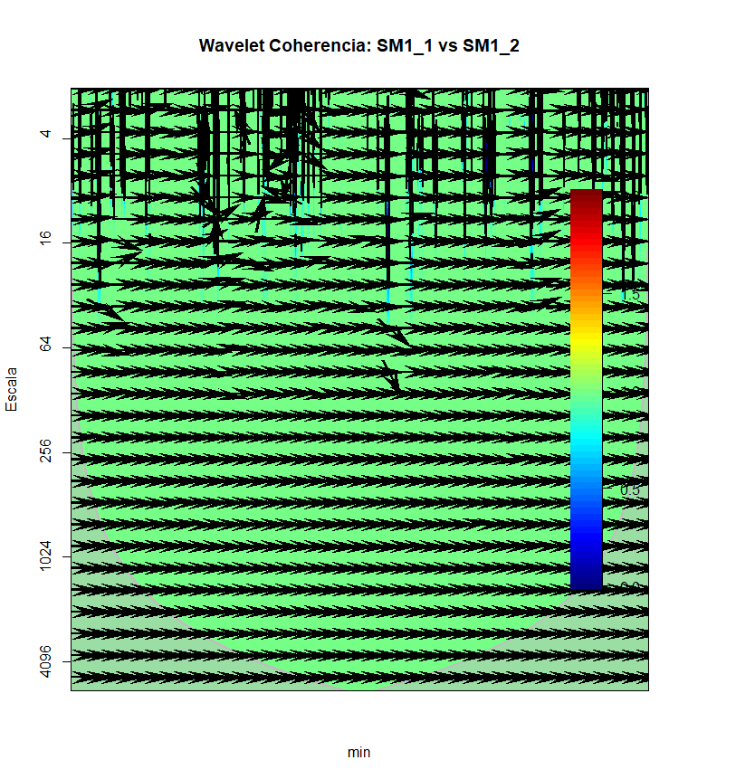
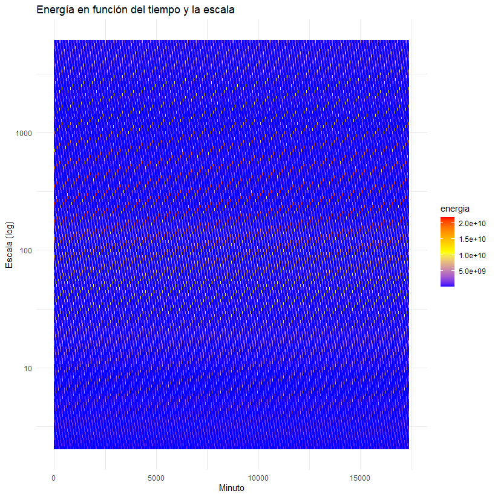
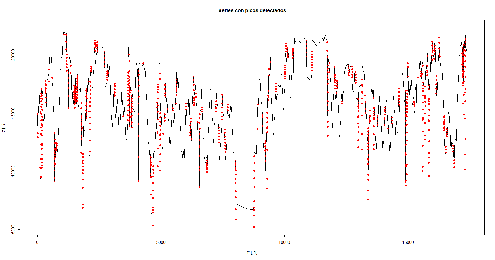

# Examen Programación en R
Examen R
Analisis de Señales presión tuberias en trazado concentraducto

**Realizado por: Marcelo Carmona -  Paula Alvarez **

Revisar Resumen Catedra 01
<a href="https://github.com/19762014mcs/Trabajo-Catedra-01/blob/main/README.md" target="_blank">Enlace Github Catedra</a>

Revisar Codigo en Posit
<a href="https://posit.cloud/spaces/658449/content/10442178" target="_blank">Enlace Posit</a>

**Contexto**

El transporte de solidos por tuberias a larga distancia, y en especial el transporte de concentrado como pulpa o conocido en el ambito minero como concentraducto, requiere un estricto control de los parametros de operación, manteniendo un control en todo momento de presiones a lo largo de la longitud de este concentraducto, debido a que dicho transporte es realizado manteniendo la presurización de la tubería de modo de evitar complicaciones operacionales y permita el desplzamiento de la pulpa hasta el sector de alimentación a espesadores de concentrado comunmente.

Para el control y continuidad operacional de este concentraducto es relevante mantener monitoreando las presiones en las estaciones de monitoreo y de válvulas en el trazado longittudinal. La data que disponemos y que sera utilizada para el analisis respectivo, contempla cuatro estaciones de monitoreo y dos estaciones de válvulas, cada estacion de monitoreo dispone de dos trasmisores de presión donde el valor de presión es enviada remotamente a sala de control, este valor que indica la presion en punto de la tuberia en forma continua, es visualizada en pantalla de salas de sala de operaciones en instalaciones de ubicadas en la ciudad de Antofagasta, en el centro de gestión operativa.

Un transmisor de presión convierte la medición de la presión de un fluido en una señal eléctrica que puede ser transmitida a sistemas de control o visualización. Funciona detectando los cambios de presión y transformándolos en variaciones de voltaje, corriente o resistencia, que luego son amplificadas y convertidas en una señal estándar. 

Para el correcto control operacional del concentraducto es vital tomar las medidas operacionales necesarias para no exceder presiones en tuberias acorde al diseño de ingenieria establecido en su contrucción, por ello se requiere que los instrumentos (transmisores de presión) entreguen confiabilidad en la operación indicando señales permanentes que refleje los cambios que pudieran producirse en la operación de transporte de concentrado (cambios de fase agua /pulpa, variación de velocidad de bombas de desplazamiento positivo, cambios en reologías de transporte). Es relevante, del punto de vista de integridad de activos que estos instrumentos entreguen señales con la fiabilidad necesaria para sostener el control operativo de un transporte de concentrado por tuberías, es importante que en los momentos de mayor exigencias que es cuando se transporta pulpa tengamos la seguridad que las señales que estan llegando a pantalla en sala de control reflefen en todo momento cambios que pudieran producirse en el proceso de modo de conocer las tendencias en la presurización de estas tuberias y tomar los resguardos necesarios para mantener la continuida operativa del sistema.


 


Por ello, en este trabajo se plantea analizar dichas señales de instrumentos ubicados en la primera estación de monitoreo (SM1) del trazado por la importancia que posee en el trazado de transporte de concentrado de la pulpa desde la estación de bombeo, esta estación posee dos transmisores de presion (SM1_1 y SM1_2), esto con el fin de identificar la operatividad de estos instrumentos, si guardan relación su medición , en que frecuencias se identifica una mayor coherencia, si existe relación entre cambios o eventos que se pueden producir en la operación y los detecte, comparación de energia de señales.

Para esto, utilizaremos transformada de wavelet en particular función wtc.AB (biwavelet) del paquete en R para calcular la coherencia wavelet entre dos series temporales. Esta función proporciona información sobre la dependencia entre las series en diferentes escalas de tiempo y frecuencia.


```{r}
#Implementación de Transformada Biwavelet
library(biwavelet)
library(ggplot2)

#Obtener Grafico Coherencia Wavelet
t1 <- cbind(1:17398, PA$SM1_1)
t2 <- cbind(1:17398, PA$SM1_2)

nrands = 10 #numero de simulaciones (Montecarlo)

sum(is.na(t1)) #Revisar si tenemos datos NA
sum(is.na(t2)) #Revisar si tenemos datos NA

wtc.AB = wtc(t1, t2, nrands = nrands) #aplicando la transformada biwavelet

par(oma = c(0,0,0,1), mar = c(5,4,5,5) + 0.1 )
plot(wtc.AB, plot.phase = TRUE, xaxt='n', lty.coi = 1, col.coi = "grey", lwd.coi = 2,
     lwd.sig = 2, arrow.lwd = 0.03, arrow.len = 0.12, ylab = "Escala", xlab = "min", 
     plot.cb = T, main = "Wavelet Coherencia: SM1_1 vs SM1_2",
     ) 


```


 


Al analizar la coherencia de wavelet por medio de su gráfica podemos comparar ambas señales de los PIT ubicados al interior del bunker SM1, donde se puede observar que existe una relación de coherencia a nivel moderado por los tonos verdes de la gráfica.

La mayoria de la coherencia significativa existe en la escala 16 a 64, por lo que se puede inferir que las series o los datos de ambos pit estan mayormente relacionadas en frecuencias altas. Si interpretamos una frecuencia alta visualizando la operacion del concentraducto lo asociamos a una presurizacion mayor de la tuberia es decir valores mas altos, por lo que nos entregan un valor confiable para frecuencias altas.

Por la ubicacion de las flechas podemos indicar que las series se encuentran en fase, oscilaciones sincronizadas es decir los PIT detectarán un evento operacional relacionado en ese lapso de tiempo, donde ademas el primer PIT (SM1_01) precede al PIT (SM1_02) es el que indica la primera señal. Las flechas indican que estan en sintonía. Los PIT se relacionan sus medida mas coherentemente en frecuencias altas.

```{r}
# Calcula la energía en cada escala y tiempo
# Transformada wavelet de cada serie
wt1 <- wt(t1)
wt2 <- wt(t2)

#Estas gráficas muestran en qué escalas (frecuencias) cada serie concentra más energía 
#en distintos momentos, permitiendo identificar qué frecuencias dominan en cada serie
n# Número de escalas y tiempos
n_scales <- nrow(wt1$power)
n_times <- ncol(wt1$power)

# Crear matrices de energía en formato largo
# Para cada escala y cada tiempo, extraer la energía
energy1_mat <- abs(wt1$power)
energy2_mat <- abs(wt2$power)

# Convertir a data frame largo
df1 <- data.frame(
  tiempo = rep(t1[,1], times = n_scales),
  escala = rep(wt1$period, each = n_times),
  energia = as.vector(energy1_mat),
  serie = "SM1_1"
)

df2 <- data.frame(
  tiempo = rep(t1[,1], times = n_scales),
  escala = rep(wt2$period, each = n_times),
  energia = as.vector(energy2_mat),
  serie = "SM1_2"
)

# Unir ambos
df_energy <- rbind(df1, df2)

# Ahora graficar
ggplot(df_energy, aes(x = tiempo, y = escala, fill = energia)) +
  geom_tile() +
  scale_fill_gradientn(colours = c("blue", "yellow", "red")) +
  scale_x_continuous(name = "Minuto") +
  scale_y_log10(name = "Escala (log)") +
  ggtitle("Energía en función del tiempo y la escala") +
  theme_minimal()

```

 

Si analizamos las energías de cada serie en función de la escala y tiempo, podemos visualizar que la energía es baja, es decir la serie se considera estable y de baja intensidad, es decir ambos PIT reaccionan de la misma manera entre 16 y 64 hertz, reafirmando el gráfico anterior de coherencia de Wavelet. Ratificando que los transmisores de presión siguen siendo confiables a frecuencias altas.

```{r}
#Gráfico Series Originales vs frecuencias medias filtradas

# Selecciona las escalas en el rango deseado
indices <- which(wt1$period >= 16 & wt1$period <= 64) #De interpretación de wavelet Coherencia

# Extrae las componentes en esas escalas
wave_subset <- wt1$wave[indices, , drop=FALSE]  # matriz escala x tiempo

# Convertir a magnitud (valor absoluto)
reconstruccion1_mag <- Mod(colSums(wave_subset))

df_recon <- data.frame(
  tiempo = t1[,1],
  original = t1[,2],
  filtrada = reconstruccion1_mag
)

ggplot(df_recon, aes(x = tiempo)) +
  geom_line(aes(y = original, color = "Original")) +
  geom_line(aes(y = filtrada, color = "Filtrada (16-64)")) +
  labs(
    title = "Serie original vs. filtrada en frecuencias medias",
    x = "Tiempo (minutos)",
    y = "Valor"
  ) +
  scale_color_manual(values = c("blue", "red")) +
  theme_minimal()
#-------------------------------------------------------------------------------
```

 

A traves del grafico anterior correspondiente a espectometria de potencia, se graficó para comparar la señal original versus la media de sus valores, determinando la energia de cada una de estas variables y poder comparar ambos graficos y ver si la energia promedio de cada una se condice con la coeherencia de Wavelet. Sabemos que el rango mas coherencia de ambas señales de comportamiento es entre 16 a 64 hertz, estableciendo de que manera la señal original la comparamos con la frecuencia media filtrada de esta forma se aisla el ruido.

Si observamos la linea azul correspondiente a los datos originales y la linea roja correspondiente a los datos filtrados podemos interpretar lo siguiente; la linea roja filtrada sigue una tendencia similar a la linea azul pero con menor variabilidad la linea roja por lo que se puede afirmar que los componentes en esa frecuencia 16 a 64 hertz capturan gran parte del comportamiento general de la serie eliminando los detalles de frecuencias muy altas o muy bajas, es decir reducen el ruido.

Se concluye que la filtración en estos rangos de frecuencia logra seleccionar la estructura general de los valores sin fluctuaciones rapidas y con ruido, por lo que además se logra concluir que ambos PIT que se encuentran en la estación de monitoreo EM1en esta frecuencia de entre 16 y 64 reflejan en mayor proporcion una mejor coherencia . A través de todo el análisis realizado consideramos que los instrumentos actuales en la estación de monitoreo nos entregan la confianza para los eventos de presurizacón de la tuberia, que es cuando los rangos de operación se encuentran cercanos a los máximos.

Se puede inferir que los cambios repentinos en la operación no son a intervalos regulares, esto puede ser por diferentes factores operacionales, como variacion desde sala con las variables velocidad, cambios reológicos de la pulpa a transportar entre otros. El análisis acotado de las presiones en EM1 indican que se debe prestar la atención suficiente y constante en la operatividad del concentraducto a la fecha.

```{r}
#Analisis de eventos o picos
library(zoo)

# Derivada (diferencias) para detectar cambios bruscos
diff_series <- diff(t1[,2])

# Detectar picos grandes
picos <- which(abs(diff_series) > quantile(abs(diff_series), 0.95))

# Graficar
plot(t1[,1], t1[,2], type='l', main='Series con picos detectados')
points(t1[picos,1], t1[picos,2], col='red', pch=19)

```

 

Al analizar grafico de series con picos o eventos relevantes, estos están distribuidos relativamente de manera uniforme a lo largo del tiempo, con una cierta concentración en varias zonas, pero sin patronmes claros de periodicidad. La presencia de estos eventos pueden señalar eventos importantes o anomalias en la serie, pueden corresponder a eventos específicos en el proceso que mide la serie: cambios súbitos en la variable, eventos externos, errores de medición, o episodios relevantes. La distribución uniforme de picos sugiere que estos eventos no están asociados a una tendencia o patrón periódico, sino que ocurren de manera más aleatoria o como respuesta a eventos externos.


